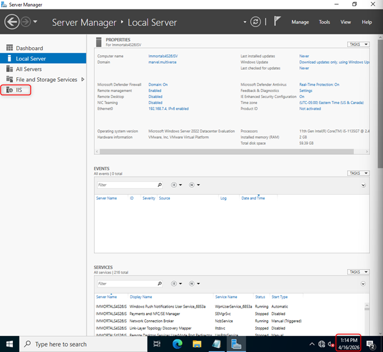
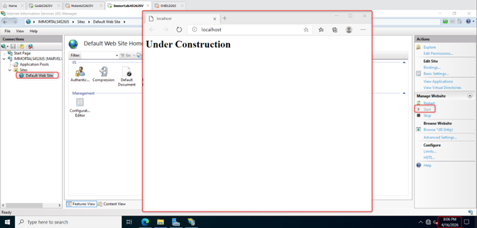

# Windows Server IIS Web Server Lab

## Overview
This project demonstrates installation and configuration of Internet Information Services (IIS) on a Windows Server file server, including deployment of a custom launch page.

---

## Objectives
- Install the Web Server (IIS) role
- Verify IIS services are running
- Configure the default website
- Deploy a custom HTML launch page
- Test local web access using localhost

---

## Technologies Used
- Windows Server
- Internet Information Services (IIS)
- HTML
- Microsoft Edge
- VMware Workstation Pro

---

## References
- RootUsers IIS installation guide
- ChatGPT used for supplemental guidance

---

## Configuration Steps

### Install IIS
- Opened Server Manager
- Selected Add Roles and Features
- Installed Web Server (IIS) role
- Verified IIS installed successfully

---

## Configure Default Site
Navigated to:

```text
C:\inetpub\wwwroot
```

- Removed default:
```text
iisstart.html
```

- Created:

```html
<h1>Under Construction</h1>
```

- Saved file as:

```text
index.html
```

---

## Validation

### IIS Installed


### Custom Launch Page


---

## Skills Demonstrated
- Windows Server administration
- IIS role installation
- Web server configuration
- Static web page deployment
- Service validation and troubleshooting

---

## Lessons Learned
- IIS uses the wwwroot directory for default content
- index.html overrides default launch behavior
- Web services can be quickly deployed with native Windows Server roles

---

## Future Improvements
- Add DNS name mapping for site access
- Host multiple IIS sites
- Add SSL/TLS configuration
- Explore IIS security hardening
